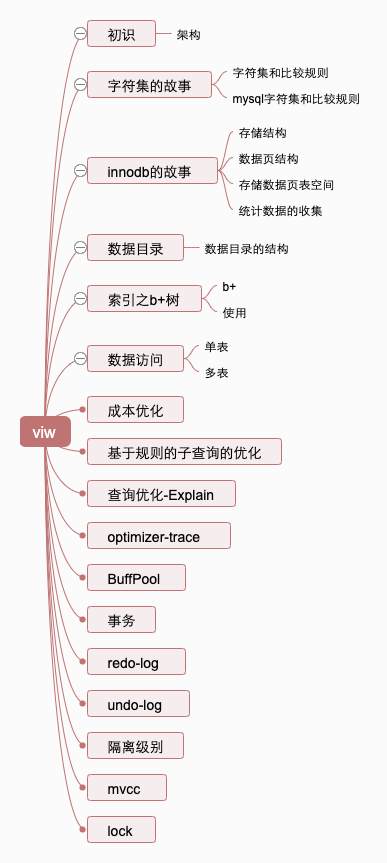

<!-- TOC -->

- [mysql是怎样运行的](#mysql是怎样运行的)
  - [1.概念](#1概念)
  - [2.字符集](#2字符集)
  - [3.innodb的故事](#3innodb的故事)
  - [4.索引之b+树](#4索引之b树)

<!-- /TOC -->
# mysql是怎样运行的

写在前面
> km文件是书的脑图,这里主要是记录细节部分

## 1.概念

## 2.字符集

## 3.innodb的故事

## 4.索引之b+树

