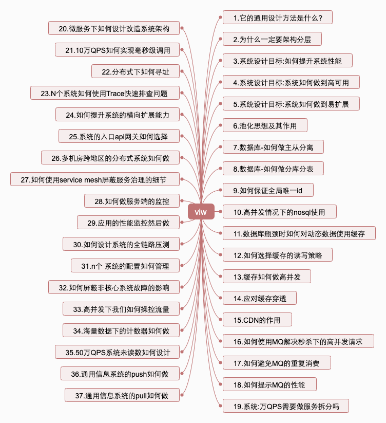
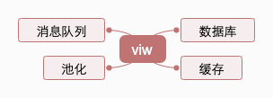

<!-- TOC -->

- [写在前面](#写在前面)
  - [系统设计原则和目标是什么](#系统设计原则和目标是什么)
  - [池化思想可以给我们带来什么](#池化思想可以给我们带来什么)
  - [持久数据的数据库如何应对高并发](#持久数据的数据库如何应对高并发)
  - [全局唯一流水uuid如何考虑](#全局唯一流水uuid如何考虑)
  - [数据库瓶颈时如何使用缓存](#数据库瓶颈时如何使用缓存)
  - [如何利用CDN](#如何利用cdn)
  - [如何利用MQ来应对高并发](#如何利用mq来应对高并发)

<!-- /TOC -->
# 写在前面

 **40问：**

**三高系统设计梳理:**

## 系统设计原则和目标是什么

## 池化思想可以给我们带来什么

## 持久数据的数据库如何应对高并发

## 全局唯一流水uuid如何考虑

## 数据库瓶颈时如何使用缓存

## 如何利用CDN

## 如何利用MQ来应对高并发

